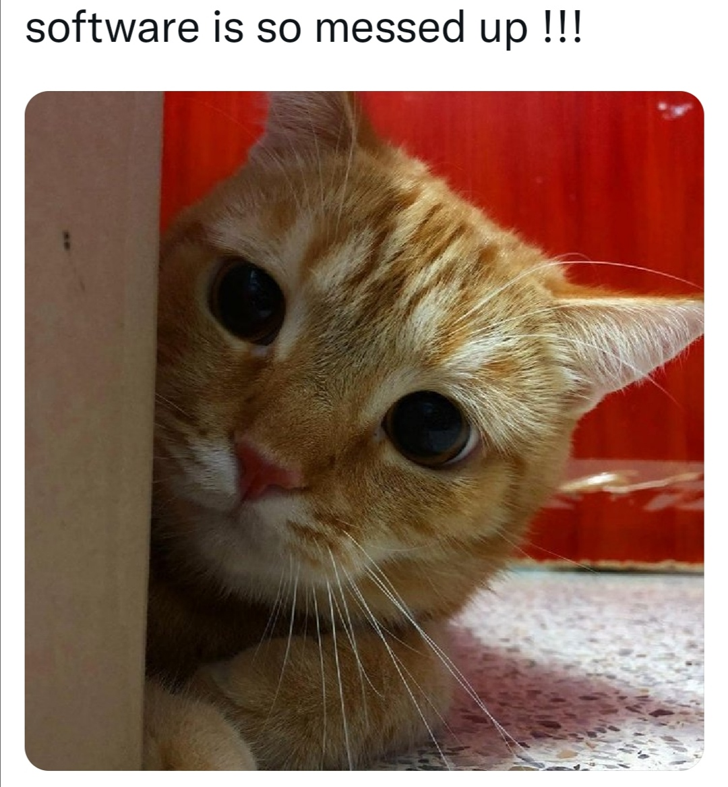

<h1 align="center">Hi there ٩( ๑╹ ꇴ╹)۶</h1>

<h3>Currently focused working on:</h3>

* Cross-Platform App Development (Flutter, Dart, MongoDB, Firebase)

<h3>Already worked with:</h3>

* Java, Spring, Docker, Jenkins, Kubernetes

<h3>Want to learn:</h3>

* Kotlin

<h4 align="left">Connect with me:</h4>

